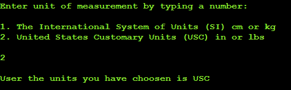
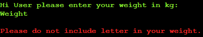

# BMI Calculator 🖩 in 🐍 Python

## [See Live web](https://bmi-calculator-pp3.herokuapp.com/)

# Introduction

Welcome to my third Full Stack Course project. This is a Body Mass Index (BMI) calculator.

In this project the goal was to create an useful program while using python language. As most of us are concerned about our own health, I decided to build a user-friendly BMI (body mass index) calculator.

Hope you will find intresting to use this tool.

# Table of Contents

[1. **UX**](#ux)
* [**1.1. Strategy**](#strategy)
    * [Project Goals](#projectGoals)
    * [User target](#userTarget)
    * [1st time visitors](#firstTime)
    * [Returning visitors](#returning)
    * [User expectations](#userExpectations)

* [**1.2. Structure**](#structure)
* [**1.3. Skeleton**](#skeleton)
* [**1.4. Surface**](#surface)

[2. **Features**](#features)

[3. **Technologies Used**](#technologies)

[4. **Testing**](#testing)

[5. **Development Cycle**](#development)

[6. **Deployment**](#deployment)

[7. **End Product**](#endProduct)

[8. **Known Bugs**](#knownBugs)

[9. **Credit**](#credits)

[Back to Table Of Content](#tableOfContents)

# 1. UX

As a next step on my path of becoming a software developer from zero to hero 😊, I'm presenting a BMI Calculator.

As mentioned in my last projects my ultimate goal is to change my career path and become a full time developer. Here I will be showing my new acquired skill, which is Python.

As part of my portfolio collection, which can be shown to my potential future employers. I have decided to build a product that can be used daily to identify if user weight is within a healthy level, using a well known method. Users can enter the data in either SI or USC unit measurement and the calculator will show the BMI category.

[Back to Table Of Content](#tableOfContents)

# 1.1 Strategy

## Project Goals

The reason for this web page is to show my skills to potential recruiters and all who want to cooperate with me in the future in projects.

The project has been built by using Python 🐍. 

[Back to Table Of Content](#tableOfContents)

## User Target

[Back to Table Of Content](#tableOfContents)

## First time visitors

* 1st time Visitors who wants to see my portfolio products;
* 1st time Visitors who wants to use BMI calculator;

[Back to Table Of Content](#tableOfContents)

## Returning visitors

* Visitors who would like to use calculation again

[Back to Table Of Content](#tableOfContents)

## User Expectations

* Clear description
* Intuitive process
* Ability to use different measurement unit

[Back to Table Of Content](#tableOfContents)

# 1.2. Structure

Type your name so massages will be personalised

BMI is widely known method, where you need to place details like:

* **Age** to define if user is under or over 18
* **Weight** of user
* **Height** of user 

Based on this values program will show your weight health values based on age under or over 18 as per list below:

## Age Under 18:

* Underweight         < 18.5
* Normal              18.5 - 24.9
* Overweight          25 -29.9
* Obesity             > 29.9

## Age Over 18:

* Severe Thinness	    < 16
* Moderate Thinness	16 - 17
* Mild Thinness	    17 - 18.5
* Normal	            18.5 - 25
* Overweight	        25 - 30
* Obese Class I	    30 - 35
* Obese Class II	    35 - 40
* Obese Class III	    > 40

Calculations are perform using two types of measurement units:

* **SI** known as Metric measured in meters and kilograms, as per function below:

    **BMI = mass(kg)/height^2(m^2)**

* **USC** known as United States Customary Units measured in inches and pounds, as per function below:

    **BMI = [mass(lb)/height^2(in^2)]x703**

[Back to Table Of Content](#tableOfContents)

# 1.3. Skeleton

Logic of this calculator is describe in the diagram below:

[Back to Table Of Content](#tableOfContents)

# 1.4. Surface

As a presentation level and to provide a clear understanding for user as well as what is currently expected form user I did choose to use ANSI gamma colors for:

* **Title** in Bright Blue color (\033[1;34;40m)
* **BMI logo** in multiple colors used in program
* **Explanation - general program color** in Bright Magenta color (\033[1;35;40m)
* **Questions - User Input Request** in Bright Green color (\033[1;32;40m)
* **Incorrect data input** in Bright Red color (\033[1;31;40m)
* **End process message** in Yellow color (\033[1;33;40m)

[Back to Table Of Content](#tableOfContents)

# 2. Features

* Describe your weight health
* Present incorrect data type message in Bright Red color (\033[1;31;40m)
* Personalised messages with "Hi {name} ..." format
* Splitting sections to ensure good readability while run the code

[Back to Table Of Content](#tableOfContents)

# 3. Technologies Used

### **During creation journey I did use:**

* [Chrome](https://www.google.com/intl/en_uk/chrome/)
    * Chrome dev tool used to debug and test code while building
* [Github](http://github.com)
    * For storing project code written in gitpod
* [W3School](https://www.w3schools.com/)
    * For problem solving and code searching
* [PEP8 validator](http://pep8online.com/)
    * For checking python convention
* [VS Code](https://code.visualstudio.com/)
    * To test section of code in case of problems
* [Click Chart](https://www.mindmanager.com/en/?link=wm)
    * To create project diagram
* [Heroku](https://id.heroku.com/login)
    * To deploy project into live environment

[Back to Table Of Content](#tableOfContents)

# 4. Testing

### **PEP8**

* Test using PEP8 validator to avoid conventions errors, pass in first approach

### **Manual testing**

* Incorrect type of data provided into the terminal to ensure triggering correct messages
* Testing multiple scenarios to ensure correct color will be displayed to terminal
* While coding, I did perform test through the terminal each time once new function was implemented, also used a VS Code to test function separately
* Tested final project on Heroku

### **Function tests**

## **Name**

**Name Digit Test**

**Name Pass Test**

## **Age**

**Age Letter Test**

**Age Pass Test**

## **Unit**

**Unit Wrong Value Test**

**Unit SI Pass Test**

**Unit USC Pass Test**

## **Weight**

**Weight SI Letter Test**

**Weight SI Pass Test**

**Weight USC Letter Test**

**Weight USC Pass Test**

## **Height**

**Height SI Letter Test**

**Height SI Pass Test**

**Height USC Letter Test**

**Height USC Pass Test**

## **Result**

**Result**

## **Exit or Continue**

**Exit wrong Value Test**

**Continue?**

**Exit?**

[Back to Table Of Content](#tableOfContents)

# 5. Development

Page was builded according to a diagram defined in the beginning of the project. Each function works correctly. In the last stage of this process the colors and visual features were added to improve overall UX.

# 7. End Product

## **End Product screens**

# 8. Known bugs

## **Fixed bugs**

During development I did face few bugs:

* Transfering results between functions - fixed by setting return value to global scope
* Calculation wasn't receiving float numbers - fixed by specifying the numbers from input to float in calculation
* Breaching PEP8 conventions by typing too long lines (over 80 characters) - fixed by adding variables with text included in as string

***All known bugs were corrected before deployment***

[Back to Table Of Content](#tableOfContents)

# 9. Credits

## **Special thanks to**

### **@Marcel(Mentor) Mulder** for constructive feedback and amazing tips