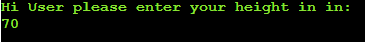

# BMI Calculator 🖩 in 🐍 Python

## [See Live web](https://bmi-calculator-pp3.herokuapp.com/)

# Introduction

Welcome to my third Full Stack Course project. This is a Body Mass Index (BMI) calculator.

In this project the goal was to create an useful program while using python language. As most of us are concerned about our own health, I decided to build a user-friendly BMI (body mass index) calculator.

Hope you will find intresting to use this tool.

# Table of Contents

[**1. UX**](#ux)
* [**1.1. Strategy**](#strategy)
    * [**1.1.1 Project Goals**](#projectGoals)
    * [**1.1.2 User target**](#userTarget)
        * [**1st time visitors**](#firstTime)
        * [**Returning visitors**](#returning)
    * [**1.1.3 User expectations**](#userExpectations)

* [**1.2. Structure**](#structure)
    * [**1.2.1 User input**](#userInput)
    * [**1.2.2 Calculation outcome**](#calculationOutcome)
    * [**1.2.3 Calculation method**](#calculationMethod)

* [**1.3. Skeleton**](#skeleton)
* [**1.4. Color Scheme**](#colorScheme)

[**2. Features**](#features)

[**3. Technologies Used**](#technologies)

[**4. Testing**](#testing)
* [**4.1 PEP8**](#pep)
* [**4.2 Manual Testing**](#manualTesting)
* [**4.3 Function tests**](#functionTest)

[**5. Development Cycle**](#development)

[**6. Deployment**](#deployment)

[**7. End Product**](#endProduct)

[**8. Known Bugs**](#knownBugs)
* [**8.1 Fixed bugs**](#fixedBugs)
* [**8.1 Remaining Bugs**](#remainBugs)

[**9. Credit**](#credits)

[Back to Table Of Content](#tableOfContents)

# **1. UX**

As a next step on my path of becoming a software developer from zero to hero 😊, I'm presenting a BMI Calculator.

As mentioned in my last projects my ultimate goal is to change my career path and become a full time developer. Here I will be showing my new acquired skill, which is Python.

As part of my portfolio collection, which can be shown to my potential future employers. I have decided to build a product that can be used daily to identify if user weight is within a healthy level, using a well known method. Users can enter the data in either SI or USC unit measurement and the calculator will show the BMI category.

[Back to Table Of Content](#tableOfContents)

# **1.1 Strategy**

##  **1.1.1 Project Goals**

A project goal was to create a user-friendly BMI calculator for daily use, where users can monitor their weight health.

The reason for this web page is to show my skills to potential recruiters and all who want to cooperate with me in the future in projects.

The project has been built by using Python 🐍. 

## **1.1.2 User Target**

### **First time visitors**

* 1st time Visitors who wants to see my portfolio products;
* 1st time Visitors who wants to use BMI calculator;

### **Returning visitors**

* Visitors who would like to use calculation again

## **1.1.3 User Expectations**

* Clear description
* Intuitive process
* Ability to use different measurement unit

[Back to Table Of Content](#tableOfContents)

# **1.2. Structure**

## **1.2.1 User input**

* **Name** which will be used to personalised messages
* **Unit of measurement** to proceed calculation as per norm, 

BMI is widely known method, where you need to place details like:

* **Age** to define if user is under or over 18
* **Weight** of user
* **Height** of user 

## **1.2.2 Calculation outcome**

Based on this values program will show your weight health values based on age under or over 18 as per list below:

### **Age Under 18**:

* Underweight         < 18.5
* Normal              18.5 - 24.9
* Overweight          25 -29.9
* Obesity             > 29.9

### **Age Over 18:**

* Severe Thinness	    < 16
* Moderate Thinness	    16 - 17
* Mild Thinness	        17 - 18.5
* Normal	            18.5 - 25
* Overweight	        25 - 30
* Obese Class I	        30 - 35
* Obese Class II	    35 - 40
* Obese Class III	    > 40

## **1.2.3 Calculation method**

Calculations are perform using two types of measurement units:

* **SI** known as Metric measured in meters and kilograms, as per function below:

    **BMI = mass(kg)/height^2(m^2)**

* **USC** known as United States Customary Units measured in inches and pounds, as per function below:

    **BMI = [mass(lb)/height^2(in^2)]x703**

[Back to Table Of Content](#tableOfContents)

# **1.3. Skeleton**

Logic of this calculator is describe in the diagram below:

[Back to Table Of Content](#tableOfContents)

# **1.4. Color Scheme**

As a presentation level and to provide a clear understanding for user as well as what is currently expected from user I did choose to use ANSI gamma colors for:

* **Title** in Bright Blue color (\033[1;34;40m)
* **BMI logo** in multiple colors used in program
* **Explanation** in Bright Magenta color (\033[1;35;40m)
* **User Input Request** in Bright Green color (\033[1;32;40m)
* **Incorrect data input** in Bright Red color (\033[1;31;40m)
* **End process message** in Yellow color (\033[1;33;40m)

[Back to Table Of Content](#tableOfContents)

# **2. Features**

* Describe your weight health
* Present incorrect data type message in Bright Red color (\033[1;31;40m)
* Personalised messages with "Hi {name} ..." format
* Splitting sections to ensure good readability while run the code

[Back to Table Of Content](#tableOfContents)

# **3. Technologies Used**

**During creation journey I did use:**

* [Chrome](https://www.google.com/intl/en_uk/chrome/)
    * Chrome dev tool used to debug and test code while building
* [Github](http://github.com)
    * For storing project code written in gitpod
* [W3School](https://www.w3schools.com/)
    * For problem solving and code searching
* [PEP8 validator](http://pep8online.com/)
    * For checking python convention
* [VS Code](https://code.visualstudio.com/)
    * To test section of code in case of problems
* [Click Chart](https://www.mindmanager.com/en/?link=wm)
    * To create project diagram
* [Heroku](https://id.heroku.com/login)
    * To deploy project into live environment

[Back to Table Of Content](#tableOfContents)

# **4. Testing**

## **4.1 PEP8**

* Test using PEP8 validator to avoid conventions errors, pass in first approach

## **4.2 Manual testing**

* Incorrect type of data provided into the terminal to ensure triggering correct messages
* Testing multiple scenarios to ensure correct color will be displayed to terminal
* While coding, I did perform test through the terminal each time once new function was implemented, also used a VS Code to test function separately
* Tested final project on Heroku

## **4.3 Function tests**

### **Name**

***Name Digit Test***

***Name Pass Test***

### **Age**

***Age Letter Test***

***Age Pass Test***

### **Unit**

***Unit Wrong Value Test***

***Unit SI Pass Test***

***Unit USC Pass Test***

### **Weight**

***Weight SI Letter Test***

***Weight SI Pass Test***

***Weight USC Letter Test***

***Weight USC Pass Test***

### **Height**

***Height SI Letter Test***

***Height SI Pass Test***

***Height USC Letter Test***

***Height USC Pass Test***

### **Result**

***Result***

### **Exit or Continue**

***Exit wrong Value Test***

***Continue?***

***Exit?***

[Back to Table Of Content](#tableOfContents)

# **5. Development Cycle**

Page was built based on a diagram defined in the beginning of the project.
The first feature created was 'type your name' and 'main function' to allow all functions to run. Type your name gets a validation using a for loop, so each single character is tested to avoid digits input. Keeping in mind a good practice principle that *if any function can be built separately, better to do it*, I decided then to separate test for letter and digit as two functions, which can be reused where user input needs validation. User name also will be used as a part of personalised messages, and at this moment the user age function was built. Next process development was a function to choose units of measurement (SI - metric and USC - United States Customary), as this will increase the range of users. Unit of measurement is defined as a next stage of development, this is used to provide correct calculation, as per value provided by the user. Having all those details and scores in hand I was able to move to the next stage, where according to age and score the specific outcome appears in the program and will be presented to the user.
The last stage of the function building process was a *quite or continue* function where users can decide to recalculate value or end the process.

As a final implementation the colors as visual features were added to improve overall UX, ensuring that users see clearly what is happening.

The additional functions updated at the last day were, check if character is placed to avoid enter presing without any data and check for special character, to cover all potential keyboard inputs which user can insert.

Each function works correctly and was tested multiple times with multiple scenarios - [See testing photos](#testing). 

[Back to Table Of Content](#tableOfContents)

# **6. Deployment**

To deploy my final project to the cloud I used Heroku. To do this I had to:

1. Push the latest code to GitHub.
2. Go to Heroku
3. Select new in the top right corner.
4. Create new app.
5. Enter the app name and select Europe as the region.
6. Connect to GitHub.
7. Search for repo-name.
8. Select connect to the relevant repo you want to deploy.
9. Select the settings tab.
10. Add buildpack
11. Select Python, then save changes.
12. Select Nodejs, then save changes.
13. Make sure Heroku/Python is at the top of the list, followed by Heroku/Nodejs
14. Navigate to the deploy tab
15. Scroll down to Manual Deploy and select deploy branch.

[Back to Table Of Content](#tableOfContents)

# **7. End Product**

## **End Product screens**

[See testing photos](#functionTest) for more end product photo.

[Back to Table Of Content](#tableOfContents)

# **8. Known bugs**

## **8.1 Fixed bugs**

During development I did face few bugs:

* Transfering results between functions - fixed by setting return value to global scope
* Calculation wasn't receiving float numbers - fixed by specifying the numbers from input to float in calculation
* Breaching PEP8 conventions by typing too long lines (over 80 characters) - fixed by adding variables with text included in as string
* User was able to type enter and skip type name section, and create program crush once typed during weight and height section - fixed by implementing two functions to check those scenarios

## **8.2 Remaining Bugs**

No bugs remaining

***All known bugs were corrected before deployment***

[Back to Table Of Content](#tableOfContents)

# **9. Credits**

Heroku deployment instructions from Code Institute

GitHub Python Template [Code Institute](https://codeinstitute.net/)

### **Special thanks to**

**@Marcel(Mentor) Mulders** for constructive feedback and amazing tips